# 🤖 Agente IA ÓrbitaTech (Challenge ONE IA for Tech)

O **Agente IA ÓrbitaTech** é um sistema de IA Corporativo baseado em **Retrieval-Augmented Generation (RAG)** desenvolvido para responder dúvidas de colaboradores com base na documentação interna oficial da empresa ÓrbitaTech (Recursos Humanos, Financeiro, Procedimentos Operacionais, Segurança de Dados e Planejamento Estratégico).

---

## 🏗️ Arquitetura do Pipeline

```mermaid
flowchart TD
    subgraph Offline ["Etapa Offline (Pré-computada)"]
        A[Documentos em docs/] --> B[Módulos de Extração PDF, DOCX, XLSX, MD, PPTX]
        B --> C[Limpeza e Chunking ~800 chars / 150 overlap]
        C --> D[Cohere embed-multilingual-v3.0 API]
        D --> E[data/index.json Base Vetorial Commitada]
    end

    subgraph Online ["Etapa Online (Runtime Serverless Vercel)"]
        F[Usuário / Interface de Chat] -->|Pergunta + Categoria| G[API Route /api/chat]
        G --> H[Cohere embed-multilingual-v3.0 para Pergunta]
        H --> I[Similaridade de Cosseno em Memória sobre index.json]
        I -->|Top ~20 Candidatos| J[Cohere rerank-multilingual-v3.0 Reranking]
        J -->|Top ~5 Relevantes| K[Cohere command-r-plus Geração de Resposta]
        K --> L[Resposta Fundamentada com Fontes Citadas]
        L --> F
    end
```



---

## 🛠️ Tecnologias Utilizadas

- **Framework:** [Next.js](https://nextjs.org/) (App Router + TypeScript + Tailwind CSS)
- **Modelos de IA (Cohere):**
  - Embeddings: `embed-multilingual-v3.0`
  - Reranking: `rerank-multilingual-v3.0`
  - Geração (LLM): `command-r-plus`
- **Extração de Documentos:** `adm-zip`, `xlsx`, `pdf-parse`
- **Deploy:** Vercel (Serverless Edge Functions)

---

## 🚀 Instruções de Instalação e Execução Local

1. **Clonar o Repositório:**
   ```bash
   git clone https://github.com/TissianyDelmiro/orbitatech-agent.git
   cd orbitatech-agent
   ```

2. **Configurar Variáveis de Ambiente:**
   Crie um arquivo `.env.local` na raiz baseado no `.env.example`:
   ```bash
   cp .env.example .env.local
   ```
   Adicione sua chave da API Cohere em `.env.local`:
   ```env
   COHERE_API_KEY=sua_chave_cohere_aqui
   ```

3. **Instalar Dependências:**
   ```bash
   npm install
   ```

4. **Gerar ou Atualizar o Índice Vetorial (Offline):**
   ```bash
   npm run build-index
   ```

5. **Executar em Modo de Desenvolvimento:**
   ```bash
   npm run dev
   ```
   Acesse a aplicação em `http://localhost:3000`.

---

## ❓ Exemplos de Perguntas e Respostas

1. **Recursos Humanos (RH):**
   - *Pergunta:* "Como funciona o período de experiência e avaliação de desempenho?"
   - *Fonte Consultada:* `01_manual_onboarding_rh.docx` (RH)

2. **Financeiro:**
   - *Pergunta:* "Qual o limite para reembolso de refeições em viagens corporativas?"
   - *Fonte Consultada:* `02_orcamento_e_reembolso_financeiro.xlsx` (Financeiro)

3. **Operacional:**
   - *Pergunta:* "Qual é o procedimento em caso de incidente ou queda de servidor?"
   - *Fonte Consultada:* `03_manual_procedimentos_operacionais.md` (Operacional)

4. **Legal/Compliance:**
   - *Pergunta:* "Quais são as regras para classificação de dados confidenciais e LGPD?"
   - *Fonte Consultada:* `04_politica_seguranca_dados_corporativa.pdf` (Legal/Compliance)

5. **Estratégico:**
   - *Pergunta:* "Quais são os OKRs principais para o 3º Trimestre de 2026?"
   - *Fonte Consultada:* `05_okrs_roadmap_estrategico.pptx` (Estratégico)

---

## 🎥 Demonstração

### Interface do Chat

A interface do Agente ÓrbitaTech apresenta:

- Design moderno e responsivo com tema escuro
- Filtro de categorias para busca direcionada
- Histórico de conversação em tempo real
- Citação automática de fontes consultadas
- Indicador de tempo de resposta

### Exemplos de Uso

O agente é capaz de responder perguntas sobre:

- **Recursos Humanos (RH):** Onboarding, avaliação de desempenho, benefícios
- **Financeiro:** Reembolsos, orçamentos, políticas de despesas
- **Operacional:** Procedimentos, protocolos de incidentes, fluxos de trabalho
- **Legal/Compliance:** Políticas de segurança, LGPD, classificação de dados
- **Estratégico:** OKRs, roadmap, metas trimestrais

---

## 🌐 Status do Deploy

- **Plataforma:** Vercel
- **URL Pública:** [https://orbitatech-agent.vercel.app](https://orbitatech-agent.vercel.app) *(Substituir após publicar na Vercel)*

---

## 📌 Limitações e Próximos Passos

- Suporte a streaming de respostas via Server-Sent Events (SSE).
- Cache local para perguntas frequentes.
- Interface com histórico persistente no localStorage.
